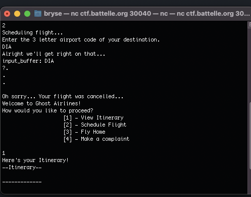
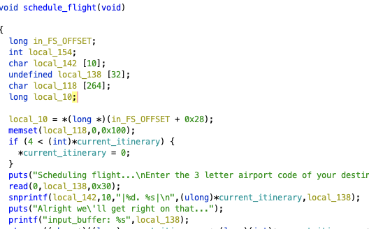
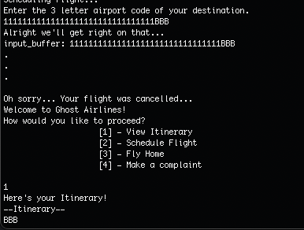
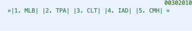
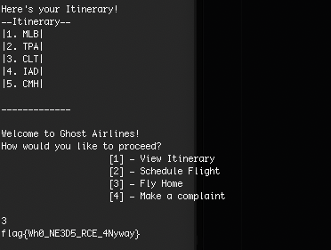

This repository contains my solution to the challenge found [here](https://solvers.battelle.org/cyber-challenge/ghosted), courtesy of Battelle.
# Introduction

This challenge was my first one, and I had a lot of fun completing it. I'm looking forward to doing more challenges when I have more free time!

# Problem Context

The challenge involves scheduling a flight back home on "Ghost Airlines" using their chatbot. However, the chatbot doesn't seem to be working as expected. We are provided with a .zip file and a Netcat command to a CTF server to work with.

# Solution

To understand the problem better, I ran the nc ctf.battelle.org 30040 command given to us. Unfortunately, the tool was not helpful at all. Whenever I tried to schedule a flight, a message popped up saying it was canceled. Additionally, when attempting to fly home, the application seemed to exit at that point.

My next step was to analyze the application using Ghidra. Fortunately, the application wasn't obfuscated, so I could quickly examine all of its functions. I'll briefly explain each option I found:\
[1] - This option simply prints the current itinerary.\
[2] - This is the option where most of the work is done. At first glance, it doesn't seem to reveal much. However, I noticed a variable (local_138) with a buffer of size 32(shown below), which will become important later.\
[3] - This option is more interesting. It contains the "print_flag" method, which compares the "current_itinerary" with another "itinerary" variable. I'll provide more details on this later.\
[4] - This option allows filing a complaint, but it simply "files" it in a /dev/null folder. I decided to ignore this method as it doesn't seem relevant.

Since it appeared that none of our flights were being added to the itinerary, I decided to try breaking the current logic by overflowing the buffer. I successfully tested this by inputting 32 "1"s as an overflow and 3 "B"s (what I hoped to get added).

Moving on to the "fly home" function, I dug deeper to find out what our itinerary needed to be. After some investigation, I discovered that the itinerary should include these 5 locations.

Armed with this knowledge, we have everything we need to find the flag. We just need to overflow the scheduled flight with 32 characters followed by "|\<#\>.\<location\>|" for all 5 locations.

Once the flights are added, we can fly home and receive a nice little flag. Thank you, Ghost Airlines! :)

